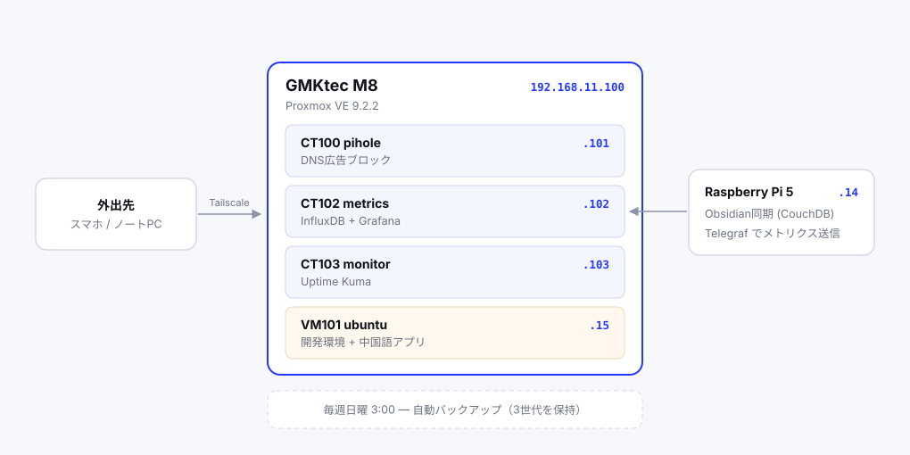

## 使ったもの

- GMKtec M8。AMD Ryzen 5 PRO 6650H、メモリ16GB、SSD 512GB。
- USB キーボード
- USB マウス
- モニター
- LANケーブル
- 中継器




仮想化基盤・DNSサーバー・監視ダッシュボード・自作アプリのホスティングなどをした。

### Pi-hole

広告をなくす

→ [Proxmox に Pi-hole を立てる](/posts/pihole-on-proxmox)

### 監視基盤

InfluxDB と Grafana を Docker で立て、各機に Telegraf を入れた。CPU・メモリ・ディスク・温度を30秒おきに収集している。

M8 からは温度センサーが11個も取れた。CPU、内蔵GPU、SSD 3系統、Wi-Fi チップ、そして LAN チップの温度まで見える。

ラズパイの CPU 温度は 48℃ 前後、M8 は 36℃ 前後。小さい筐体でファンレスに近い構成だと、こういう差が出る。

### 自作アプリのホスティング

以前 Render にデプロイしていた中国語単語アプリを引っ越した。React + Flask + PostgreSQL の3層構成を Docker Compose でまとめている。

Render の無料プランはアクセスがないとスリープして、次のアクセスで30秒待たされる。自宅サーバーならその待ちがない。

→ [自作アプリを Render から自宅サーバーに引っ越した](/posts/self-host-webapp)

### 外部アクセス

Tailscale を使った。ルーターのポートを一切開けずに、外出先から家のサーバーに繋がる。

→ [Tailscale で外出先から自宅サーバーに繋ぐ](/posts/tailscale-subnet-router)

### 死活監視

Uptime Kuma を別コンテナに立てて、Discord に通知するようにした。

**監視ツールを監視対象と同居させない**のが原則で、開発環境の VM に置くと、実験で壊したときに監視も一緒に止まる。

## 構築中に踏んだ罠

### LANポートで速度が56倍違った

一番時間を使ったのがこれ。124MB のファイルのダウンロードに48分かかった。平均 43.6KB/s。

原因は本体に付いている2つの LAN ポートのうち、片方の実効速度が極端に低かったこと。リンク速度はどちらも 1000Mb/s と表示されるのに、実測で56倍の差があった。

→ [GMKtec M8 のLANポートで速度が56倍違った話](/posts/m8-nic-speed-issue)

### BIOS で確認すべき項目

- **SVM Mode** — AMD の仮想化機能。無効だと VM が起動しない（M8 では既定で有効だった）
- **IOMMU** — パススルーを使うなら必要
- **Auto Power On** — 停電から復帰したとき自動で電源が入る。既定は `Power off` なので変更が必要

最後のものは無人運転するサーバーには必須だ。設定を忘れると、停電のたびに電源ボタンを押しに行くことになる。

### USBメモリは DD モードで書き込む

Rufus 4.15 は Proxmox の ISO を検出して自動的に DD モードを適用してくれた。以前のバージョンだと ISO/DD の選択ダイアログが出て、ここで ISO を選ぶと起動しない。

### エンタープライズリポジトリの無効化

これをやらないと `apt update` が 401 で止まる。管理画面から No-Subscription リポジトリを追加すれば解決する。

Proxmox 9 系は Debian 13 ベースになり、APT の設定ファイルが deb822 形式に変わった。手で書くなら `bookworm` ではなく `trixie` を指定する必要がある。GUI から追加すれば意識しなくていい。

### コンテナテンプレートのアーキテクチャ

`debian-13-standard` をダウンロードしたら arm64 版が落ちてきた。GUI の一覧にはアーキテクチャの列がなく、同じ名前で2行並んでいるだけなので判別できない。

シェルから確認するのが確実だった。

```
$ pveam available --section system | grep debian-13
system  debian-13-standard_13.6-1_amd64.tar.zst
system  debian-13-standard_13.6-1_arm64.tar.zst
```

## やってみて思ったこと

**スナップショットが効く。** Proxmox の最大の利点はこれだと思う。何か試す前に取っておけば、壊しても数秒で戻せる。「壊れたらどうしよう」を考えなくていいので、実験のハードルが劇的に下がる。

**用途ごとに分離する意味。** Pi-hole は常時安定していてほしい。開発環境は壊す前提で使いたい。この2つを1台に同居させると、実験のたびに家のネットが止まる。仮想化はこの問題を解決するためにある。

**トラブルシューティングが一番身についた。** `ethtool` でリンク速度を見て、省電力機能を疑って外し、ポートを替えて実測し、`ip route` で経路を追い、最後に `ip_forward` に行き着く。この流れは教科書に載っている手順そのものだが、実際に詰まって初めて意味が分かった。

## 残っている課題

**バックアップ先が同じ SSD。** 週次バックアップは設定したが、保存先が本体と同じディスクなので、ハードウェア障害には無力だ。空いている M.2 スロットに1枚足すのが次の課題。

**センサーが未着手。** 温湿度センサーやカメラを買ってあるのだが、ピンヘッダが未実装で**ハンダごてが必要**だと気づいた。InfluxDB と Grafana という受け皿はできているので、ハンダごてさえ手に入れば繋がる。

**CI/CD。** いまはコードを直すたびに SSH で入って `docker compose up -d --build` を叩いている。GitHub に push したら自動でデプロイされる仕組みを作りたい。

---

一昨日 BIOS 画面に入れずに困っていたところから、ここまで来た。買ったばかりのミニPCが、二日で家のインフラになった。
