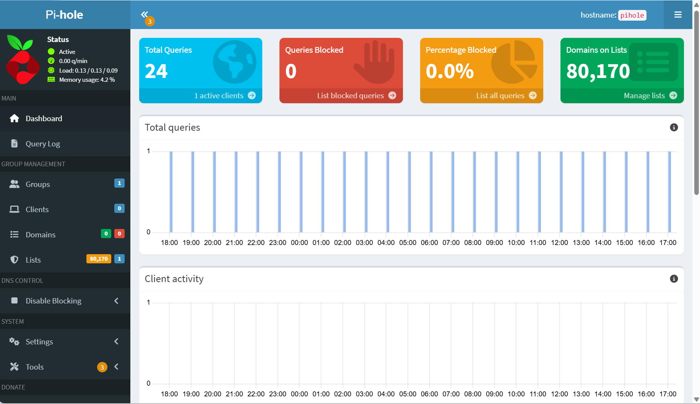
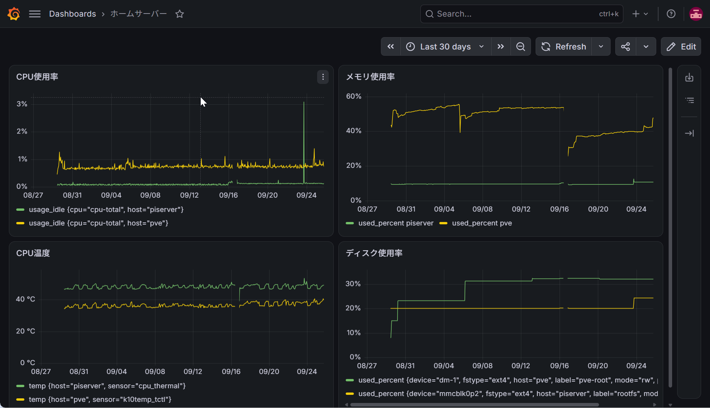
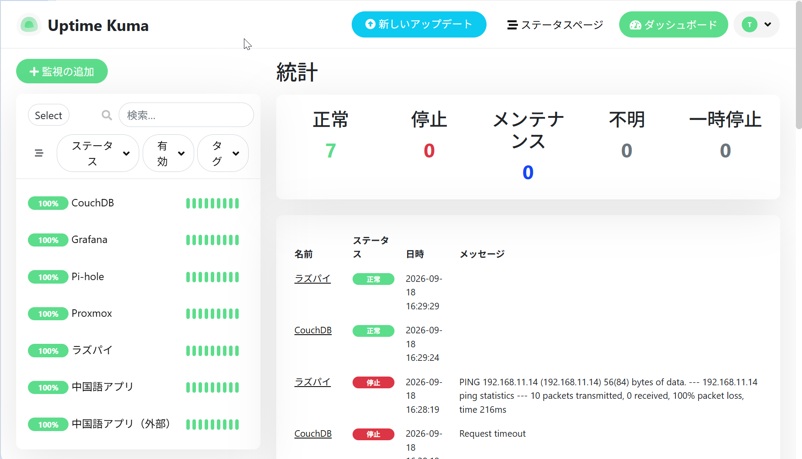
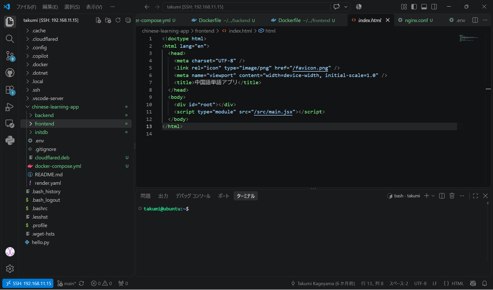

ミニPCを買って自宅サーバーを立てました。今は広告ブロック用の DNS、監視、Obsidian の同期、開発環境を1台で動かしています。

<!-- TODO: なぜ立てようと思ったか。1〜2文で -->

## 環境

- GMKtec M8（AMD Ryzen 5 PRO 6650H、12スレッド）
- メモリ 16GB、SSD 512GB
- Proxmox VE 9.2.2

Proxmox VE は仮想化用の OS です。Web の管理画面から VM やコンテナを作れます。

## 動かしているもの

| ID | 名前 | 種別 | 役割 |
|---|---|---|---|
| 100 | pihole | LXC | DNS で広告をブロックする |
| 102 | metrics | LXC | InfluxDB + Grafana でメトリクスを貯めて見る |
| 103 | monitor | LXC | Uptime Kuma で死活監視 |
| 104 | couchdb | LXC | Obsidian のノート同期 |
| 101 | ubuntu | VM | 開発環境と自作アプリの置き場 |

### Pi-hole

DNS サーバーです。広告配信に使われるドメインへの問い合わせをブロックします。
普段はあまり使っていないです。

### InfluxDB + Grafana

CPU 使用率やメモリ使用量といったメトリクス（時間とともに変化する数値）を集めて見るためのものです。InfluxDB が記録先の時系列データベースで、Grafana がそれをグラフにします。

### Uptime Kuma

死活監視ツールです。登録した URL やポートに定期的にアクセスして、応答がなければ通知します。

### CouchDB

Obsidian のノートを複数端末で同期するためのデータベースです。Obsidian 側は Self-hosted LiveSync というプラグインを使い、同期先としてこの CouchDB を指定します。

### Ubuntu（VM）

Ubuntu Server が入っています。Docker で自作の中国語単語アプリ（Nginx・Flask・PostgreSQL の3コンテナ）を動かしているほか、VS Code の Remote-SSH で接続してコードを書く場所にもなっています。Telegraf も入れていて、この VM 自身のメトリクスを InfluxDB に送っています。

