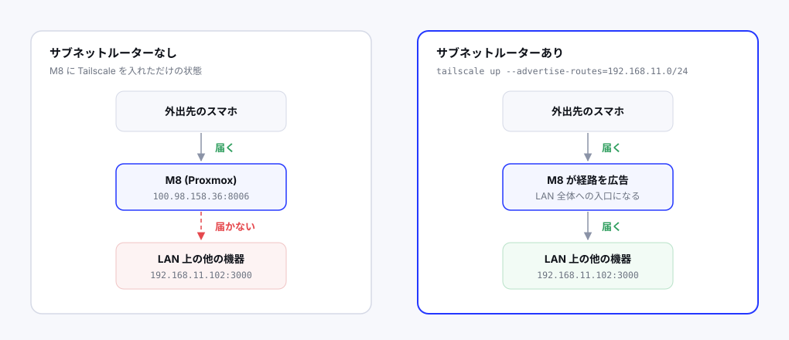

自宅サーバーを立てたら、外出先からも触りたくなる。

ルーターのポートを開けて公開する方法もあるが、設定を間違えると攻撃対象になる。SSH を外部公開すると数分で不正ログインの試行が始まるのが普通だ。

Tailscale を使えば**ポートを一切開けずに**外出先から家のサーバーに繋がる。しかも設定はコマンド2つで終わる。

## Tailscale とは

端末同士を仮想的な同じネットワークに入れる仕組み。WireGuard をベースにしたメッシュ VPN で、各端末に `100.x.x.x` の専用 IP が割り当てられる。

**内側から外部サーバーに接続を張る**方式なので、ルーターのポート開放が不要。NAT 越えも自動でやってくれる。

個人利用なら無料枠で十分（100台まで）。

## 素朴な使い方とその限界

各機器に Tailscale を入れれば、その機器同士は繋がる。

```
$ curl -fsSL https://tailscale.com/install.sh | sh
$ tailscale up
```

表示された URL をブラウザで開いて認証すれば完了。

ただしこれだと、**Tailscale を入れた機器にしか届かない。**

私の環境では M8（Proxmox ホスト）に入れた結果、

- `https://100.98.158.36:8006` → Proxmox の管理画面。届く
- `http://192.168.11.102:3000` → Grafana。**届かない**

後者が届かないのは、スマホが `192.168.11.102` への経路を知らないから。Tailscale は「M8 という1台」を繋いだだけで、その先の LAN までは面倒を見ない。



コンテナや VM が増えるたびに Tailscale を入れて回るのは現実的ではない。

## サブネットルーター

これを解決するのが**サブネットルーター**という機能だ。

1台を「LAN への入口」に指定すると、その機器経由で同じネットワークの全端末にアクセスできるようになる。

```
$ tailscale up --advertise-routes=192.168.11.0/24 --accept-dns=false
```

`--accept-dns=false` を付けているのは、Tailscale が DNS 設定を上書きするのを防ぐため。Pi-hole を使っているので、そこを触られると困る。

実行すると、管理画面に「承認待ち」として上がってくる。

`login.tailscale.com` の `Machines` から該当マシンを開き、`Subnets` の `Awaiting Approval` に出ている `192.168.11.0/24` を `Approve` する。

これで `Approved` に移動すれば設定完了だ。

## どの機器をルーターにするか

私は M8（Proxmox ホスト）を選んだ。ラズパイも常時稼働しているので候補だったが、

- 主要なサービスが M8 上にある（経路が最短）
- Proxmox は常時稼働が前提で止まりにくい
- ラズパイには Obsidian 同期という別の役割がある

という理由で M8 にした。

ラズパイ側の利点は「M8 が落ちても届く」ことだが、M8 が落ちていれば Grafana も Pi-hole も止まっているので、繋がったところで見るものがない。

両方に設定して冗長化することもできる。

## ハマったところ：ip_forward が 0

設定したのにスマホから繋がらない。M8 自身の Tailscale IP には届くのに、その先の LAN に出られない。

切り分けとして、まず単純な経路を試した。

```
https://100.98.158.36:8006   → 繋がる
http://192.168.11.102:3000   → 繋がらない
```

Tailscale 自体は動いている。サブネットルーティングだけが機能していない。

```
$ sysctl net.ipv4.ip_forward
net.ipv4.ip_forward = 0
```

**IP 転送が無効だった。**

パケットを別のインターフェースに転送する機能で、これがオフだとルーターとして振る舞えない。Tailscale のインストーラは通常これを設定するが、警告が流れて見落としていたようだ。

Proxmox で既定オフなのは、VM のネットワークをブリッジで処理していてルーティングを必要としないから。ブリッジは L2 で動くので、L3 の転送機能は要らない。

有効化する。

```
echo 'net.ipv4.ip_forward = 1' >> /etc/sysctl.d/99-tailscale.conf
echo 'net.ipv6.conf.all.forwarding = 1' >> /etc/sysctl.d/99-tailscale.conf
sysctl -p /etc/sysctl.d/99-tailscale.conf
```

```
$ sysctl net.ipv4.ip_forward
net.ipv4.ip_forward = 1
```

即座に繋がった。

`/etc/sysctl.d/` にファイルとして置いているので、再起動後も維持される。`sysctl -w` だけだと一時的な変更で消えてしまう。

## Key expiry を無効化する

既定では、認証キーが**180日で失効する。**

失効すると再認証が必要になるが、外出先で切れると家に帰るまで復旧できない。サーバー用途では困る。

`login.tailscale.com` の `Machines` からマシンを選び、`Machine settings` → **`Disable key expiry`**。

一覧に `Expiry disabled` のバッジが付けば設定完了。サーバーとして常設する機器にはすべて設定しておくべきだ。

## 使えるようになるもの

外出先から、家にいるときと**同じ URL** でアクセスできる。

| サービス | URL |
|---|---|
| Grafana | `http://192.168.11.102:3000` |
| Pi-hole | `http://192.168.11.101/admin` |
| Proxmox | `https://192.168.11.100:8006` |
| SSH | `ssh takumi@192.168.11.15` |

ブックマークを使い分ける必要がない。これが地味に効く。

スマホに SSH クライアント（Termius など）を入れれば、外出先からサーバーの操作もできる。

## 動作確認のコツ

**Wi-Fi を切ってモバイル回線で試す。** 同じ Wi-Fi にいると Tailscale を経由せずに直接届いてしまい、テストにならない。

繋がらないときの確認順序は、

1. Tailscale アプリが `Connected` になっているか
2. マシン一覧に対象が出ているか
3. `Subnets` が `Approved` になっているか
4. ルーター側の `ip_forward` が `1` か

私は4番で詰まった。3番までは正しく設定できていたので、原因が見えるまで時間がかかった。

## セキュリティについて

ポートを開けないので、**外部からスキャンされても何も見えない。** これが最大の利点だ。

アクセスできるのは自分のアカウントに紐づいた端末だけ。端末を紛失したら管理画面から削除すれば遮断できる。

ACL で「この端末はこのサービスだけ」といった細かい制御もできるが、個人利用なら既定のままで十分だろう。

## 他人に見せたい場合は別の手段

Tailscale はあくまで自分（と招待した人）のためのもの。作ったアプリを不特定多数に見せるなら別の方法が要る。

一時的でよければ Cloudflare Tunnel が手軽だ。

```
cloudflared tunnel --url http://localhost:8080
```

`https://ランダム.trycloudflare.com` が発行される。こちらもポート開放不要で、HTTPS も自動で付く。

用途が違うので、両方を併用するのが現実的だと思う。自分用は Tailscale、公開用は Cloudflare Tunnel。
