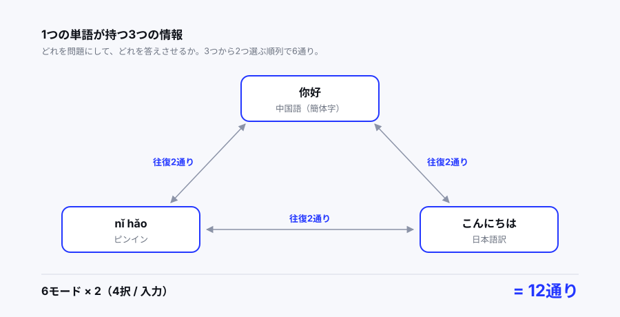

自宅サーバーの記事で「中国語アプリ」と何度か書いてきたが、アプリそのものの話は書いていなかった。作ったものの中身を残しておく。

<!-- TODO: なぜ作ったか。既存アプリ（Anki、Duolingo等）で足りなかったのは何？ 1〜2段落 -->

## どんなアプリか

400語の中国語単語を、クイズ形式で繰り返し解くだけのアプリ。

- 単語をID順に10問ずつ解く**連続モード**（40パート）
- 全単語から出す**ランダムモード**
- パートごとにベストスコアを記録し、ユーザー間でランキング表示

技術構成はこうなっている。

```
frontend  React 18 + Vite + MUI + React Router
backend   Flask + SQLAlchemy（生SQL） + PyJWT + bcrypt
database  PostgreSQL
```

## 設計で一番考えたところ：出題モード

単語データは3つの情報を持っている。

```sql
CREATE TABLE words (
    id SERIAL PRIMARY KEY,
    chinese_simplified TEXT NOT NULL,  -- 你好
    pinyin TEXT NOT NULL,              -- nǐ hǎo
    translation TEXT NOT NULL          -- こんにちは
);
```

この3つのうち**どれを問題にして、どれを答えさせるか**で、出題の種類が決まる。3つから2つ選ぶ順列なので6通りある。

```js
export const MODES = [
  { question: "chinese",     answer: "translation", label: "中国語→日本語" },
  { question: "chinese",     answer: "pinyin",      label: "中国語→ピンイン" },
  { question: "translation", answer: "chinese",     label: "日本語→中国語" },
  { question: "translation", answer: "pinyin",      label: "日本語→ピンイン" },
  { question: "pinyin",      answer: "chinese",     label: "ピンイン→中国語" },
  { question: "pinyin",      answer: "translation", label: "ピンイン→日本語" },
];
```

さらに各モードに**4択**と**入力**の2種類を用意したので、合計12通りの解き方がある。



これは意図的な設計だった。「中国語→日本語」は見れば分かるが、「日本語→中国語」を入力で答えられるかは別物だ。前者ができても後者ができないなら、その単語はまだ覚えていない。同じ400語を12通りで往復させることで、その差を潰したかった。

### モードをどうやって保存するか

スコアは「どのパートを、どのモードで、何点取ったか」で記録する必要がある。テーブルはこうした。

```sql
CREATE TABLE scores (
    user_id INT REFERENCES users(id),
    start_id INT NOT NULL,   -- パートの開始ID (1, 11, 21, ...)
    mode TEXT NOT NULL,      -- "0-choice", "3-input" など
    score INT NOT NULL DEFAULT 0,
    PRIMARY KEY(user_id, start_id, mode)
);
```

`mode` はフロント側で `${modeIndex}-${quizType}` と組み立てた文字列をそのまま入れている。

```js
const modeKey = `${modeIndex}-${quizType}`;  // 例: "0-choice"
```

**3列の複合主キーにしたのが効いた。** 「同じユーザーの同じパートの同じモード」は必ず1行しか存在しないので、更新ロジックが素直になる。新しいスコアが既存より高いときだけ UPDATE する、という処理がそのまま書ける。

```python
if not existing:
    conn.execute(text("INSERT INTO scores (...) VALUES (...)"), {...})
elif new_score > existing.score:
    conn.execute(text("UPDATE scores SET score=:score WHERE ..."), {...})
```

ただし `mode` に文字列を入れたのは、今思うと安易だった。`modeIndex` は `MODES` 配列の**添字**なので、配列の順番を入れ替えた瞬間に過去のスコアが全部別モードのものになる。DBに入る値がフロントの配列順に依存しているのは、明らかに設計として弱い。モードごとに固定のキー（`"zh2jp"` のような）を振るべきだった。

## ピンインの入力をどうするか

入力モードで一番困ったのがピンインだ。`nǐ hǎo` の声調記号を、日本語キーボードでどうやって打つのか。

解決策は、**数字で打たせて変換する**ことにした。`ni3 hao3` と入力すると `nǐ hǎo` になる。

```js
const toneMap = {
  a: ["ā", "á", "ǎ", "à"],
  e: ["ē", "é", "ě", "è"],
  i: ["ī", "í", "ǐ", "ì"],
  o: ["ō", "ó", "ǒ", "ò"],
  u: ["ū", "ú", "ǔ", "ù"],
  ü: ["ǖ", "ǘ", "ǚ", "ǜ"],
};

function convertPinyinWithNumber(input) {
  return input
    .replace(/([aeiouü])([1-4])/g, (_, vowel, tone) => {
      const t = parseInt(tone, 10) - 1;
      return toneMap[vowel][t] || vowel;
    })
    .replace(/([aeiouü])5/g, "$1");  // 5 は軽声（記号なし）
}
```

`5` を軽声（記号を付けない）に割り当てているのは、中国語学習者の間で慣習的に使われている書き方に合わせたため。`ma5` と打てば `ma` になる。

これは**ピンイン入力の一般的な慣習**でもあるので、学習者にとっては説明不要で通じる。独自ルールを作らずに済んだ。

<!-- TODO: 実際に使ってみて、この入力方式は快適だった？ 打ちにくかった単語はある？ -->

## 4択の選択肢をどう作るか

正解1つ + ダミー3つ。ダミーは同じ問題セットの中から選んでいる。

```python
def make_choices(all_words, word):
    others = [w for w in all_words if w.id != word.id]
    distractors = random.sample(others, min(3, len(others)))

    jp_choices = [word.translation] + [d.translation for d in distractors]
    zh_choices = [word.chinese_simplified] + [d.chinese_simplified for d in distractors]
    py_choices = [word.pinyin] + [d.pinyin for d in distractors]

    random.shuffle(jp_choices)
    random.shuffle(zh_choices)
    random.shuffle(py_choices)
    return jp_choices, zh_choices, py_choices
```

3種類すべての選択肢を先に作って返している。どのモードで解くかはフロント側が決めるので、サーバーは全パターンを渡しておいて、使う側が選ぶ形にした。

連続モードの場合、ダミーは**同じ10語の中から**選ばれる。これは偶然そうなったのだが、結果的に良かった。同じパート（例えば「Part 1: 基本挨拶」）の単語同士で迷うので、似た文脈の語を区別する練習になる。全400語からダミーを引くと、明らかに無関係な選択肢が並んで簡単になりすぎる。

## パートの区切り方

連続モードは10問ずつ。その開始IDの一覧を返すAPIがこれだ。

```python
@app.route("/api/quiz/sequence_ids")
def sequence_ids():
    with engine.connect() as conn:
        rows = conn.execute(text("SELECT id FROM words ORDER BY id ASC")).fetchall()
    ids = [r.id for r in rows]
    return jsonify(ids[::10])   # 10個おきに間引く
```

`ids[::10]` の一行で済んでいる。IDが1から連番なら `[1, 11, 21, ...]` が返る。

短く書けて気に入っていたが、**これは単語を1語でも削除すると壊れる。** 削除でIDに穴が空くと、`ids[::10]` は「10語ごと」を維持したまま、返る値が `[1, 11, 22, 32, ...]` のようにずれていく。そしてスコアの `start_id` は過去の値のまま残るので、記録と現在のパート区切りが対応しなくなる。

400語を固定で使う前提なら動くが、単語を足したり消したりする運用になった時点で破綻する。パート番号を `words` テーブルに列として持たせるのが正解だった。

## 認証まわり

JWT を localStorage に置く、よくある構成にした。

```python
def create_token(user_id, days_valid=1):
    payload = {
        "user_id": user_id,
        "exp": datetime.datetime.utcnow() + datetime.timedelta(days=days_valid)
    }
    return jwt.encode(payload, app.config["SECRET_KEY"], algorithm="HS256")
```

フロント側は `authFetch` でラップして、トークンの付与と401時の処理をまとめた。

```js
export function authFetch(url, options = {}) {
  const token = localStorage.getItem("token");
  const headers = {
    ...(options.headers || {}),
    "Content-Type": "application/json",
    ...(token ? { Authorization: `Bearer ${token}` } : {}),
  };

  return fetch(url, { ...options, headers }).then(async (res) => {
    if (res.status === 401) {
      localStorage.removeItem("token");   // 期限切れトークンを掃除
      throw new Error("Unauthorized");
    }
    return res;
  });
}
```

**401を受け取ったら即座にトークンを消す**のがポイント。有効期限は1日なので、放置すると必ず切れる。切れたトークンを持ったまま操作し続けて延々エラーになる状態を避けたかった。

## 今読み返すと直したい箇所

書いた当時は動けばよしとしていたが、改めて読むと気になる部分がいくつかある。

### 例外を全部握りつぶしている

ユーザー登録の処理がこうなっている。

```python
try:
    with engine.begin() as conn:
        conn.execute(text("INSERT INTO users (username,password_hash) VALUES (:u,:p)"), {...})
except:  # 既に同じユーザー名が存在する場合など
    return jsonify({"status":"error","message":"ユーザー名が既に存在"}), 400
```

裸の `except:` なので、**DBが落ちていても「ユーザー名が既に存在」と表示される。** 原因が全く違うのに同じメッセージが出るので、デバッグのときに嘘の情報を掴まされる。`IntegrityError` だけを捕まえて、それ以外は500として上げるべきだった。

### 正解がレスポンスに入っている

クイズAPIのレスポンスは、選択肢だけでなく正解そのものを含んでいる。

```python
quiz_data.append({
    "id": w.id,
    "chinese": w.chinese_simplified,
    "answer": w.translation,     # ← 正解
    "choices": jp,
    ...
})
```

採点をフロント側でやっているためこうなっているのだが、DevTools のネットワークタブを開けば答えが全部見える。ランキング機能がある以上、本来は答え合わせをサーバー側でやるべきだ。

とはいえ、これは**自分の学習用アプリなので割り切った**部分でもある。カンニングして困るのは自分だけだし、その代わりに毎問サーバーと通信する必要がなくなって、体感速度は明らかに速い。

### ランキングをPythonで計算している

```python
users = conn.execute(text("SELECT id, username FROM users")).fetchall()
scores = conn.execute(text("SELECT user_id, start_id, mode, score FROM scores")).fetchall()

for u in users:
    for s in scores:          # 全ユーザー × 全スコアの二重ループ
        if s.user_id == u.id:
            ...
```

全ユーザーと全スコアをメモリに読み込んで、Python側で突き合わせている。`SELECT user_id, SUM(score) FROM scores GROUP BY user_id` の一行で済む処理だ。

ユーザーが数人なら問題にならないが、SQLでやれることをアプリ側でやってしまっている典型例だと思う。

## Render から自宅サーバーへ

最初は Render の無料プランにデプロイしていた。`render.yaml` でフロント・バックエンド・DBの3サービスを定義する構成。

```yaml
services:
  - type: web
    name: chinese-learning-backend
    startCommand: gunicorn app:app
    envVars:
      - key: SECRET_KEY
        generateValue: true    # Render側でランダム生成してくれる
```

`generateValue: true` は便利だった。JWT の秘密鍵を自分で用意してリポジトリに置く必要がない。

ただし無料プランは15分アクセスがないとスリープする。次のアクセスで30秒待たされるのが、人に見せるときに致命的だった。結局これが理由で自宅サーバーに移した。その話は[別の記事](/blog/04-self-host-webapp/)に書いた。

## まとめ

<!-- TODO: 実際に使って中国語は覚えられた？ 400語のうちどれくらい？ 作ってよかった点・次に作るなら変える点 -->

コードは GitHub に置いてある。

<!-- TODO: リポジトリのURL。公開してよければ貼る -->
