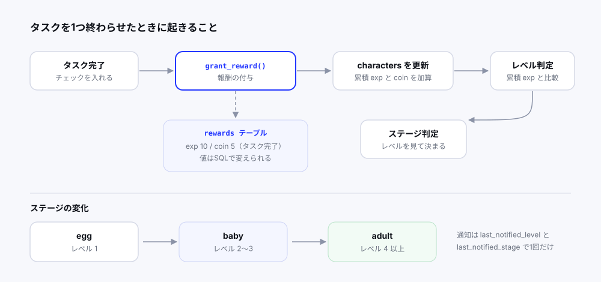

6人チームのハッカソンでタスク管理アプリを作った。個人開発とは別の難しさがあったので、設計の話と一緒に残しておく。

<!-- TODO: ハッカソンの基本情報。期間は？ 主催・テーマは？ 結果はどうだった？ 2〜3文で -->

## 何を作ったか

タスク管理アプリに**育成ゲームを乗せた**もの。

タスクを完了すると経験値とコインがもらえる。経験値が貯まるとキャラクターがレベルアップし、卵（egg）→ ひな（baby）→ 成鳥（adult）と姿が変わる。コインはショップで使えて、餌を買うと空腹度が回復する。

「タスク管理アプリは続かない」という問題に、**続ける理由を外から与える**アプローチで答えている。

技術構成はこうなった。

```
frontend  Vue 3 + Vite + Vuetify + Pinia + vue-router
backend   FastAPI + PostgreSQL（生SQL）
AI        Gemini API（タスクの自動振り分け）
連携      Google Calendar API
認証      JWT
```

機能を並べるとこうなる。

- タスクのCRUD、優先度・タグ・色・ピン留め
- キャラクター育成（レベル / ステージ / 空腹度）
- ショップと餌アイテム
- デイリーミッション（ログイン、タスク作成）
- Google カレンダー連携
- **Gemini によるタスクの自動スケジューリング**

<!-- TODO: 6人でどう役割分担した？ 自分がどこを担当することになった経緯 -->

私が主に触ったのはキャラクター周り（レベル・ステージ・通知・アニメーション）と、認証方式の変更だった。

## 報酬をコードに書かない

ゲーム要素を入れるとき、最初に決めたのが**報酬の値をDBに置く**ことだった。

```sql
CREATE TABLE rewards (
    id SERIAL PRIMARY KEY,
    reward_type VARCHAR(20) NOT NULL,   -- 'task' / 'daily_mission'
    target_type VARCHAR(20),            -- 'login' / 'create_task' / 'default'
    exp INTEGER DEFAULT 0,
    coin INTEGER DEFAULT 0,
    description TEXT DEFAULT ''
);

INSERT INTO rewards (reward_type, target_type, exp, coin, description) VALUES
('daily_mission', 'login',       20, 10, 'ログインミッション'),
('daily_mission', 'create_task', 20, 10, 'タスク作成ミッション'),
('task',          'default',     10,  5, 'タスク完了報酬');
```

付与する側は、種類を指定して引くだけになる。

```python
def grant_reward(user_id: int, reward_type: str, target_type: str = None):
    reward = execute_query(
        "SELECT exp, coin FROM rewards WHERE reward_type=%s AND target_type=%s",
        (reward_type, target_type),
        fetchone=True
    )
    ...
    # 経験値・コインを加算 → レベル判定 → ステージ判定
    level_info = check_and_update_level(user_id)
    stage_changed_to = check_and_update_stage(user_id)
```

**これが効いたのはバランス調整のときだった。** ゲーム要素は「1タスク何EXPが気持ちいいか」を実際に触りながら決めるしかない。値をコードに書いていたら、調整のたびにコードを直してレビューを通してマージ、という手順を踏むことになる。SQLのUPDATE一発で変えられる形にしておいたおかげで、試行の回数を稼げた。



チーム開発だと特に効く。値の調整とロジックの実装を、別の人が同時に進められる。

## 通知を「1回だけ」出す

レベルアップしたときに「レベルが上がりました」と出したい。これが思ったより厄介だった。

APIはステートレスなので、サーバーは「このユーザーに通知を出したかどうか」を覚えていない。素直に実装すると、レベルアップ後にキャラクター情報を取得するたびに通知が出続ける。画面を開き直すたびに祝われることになる。

解決策として、**どこまで通知したかをDBに持たせた。**

```sql
CREATE TABLE characters (
    ...
    level INTEGER DEFAULT 1,
    last_notified_level INTEGER DEFAULT 1,         -- 通知済みのレベル
    last_notified_stage VARCHAR(20) DEFAULT 'egg'  -- 通知済みのステージ
);
```

`level` と `last_notified_level` を比較して、差があるときだけ通知を出し、出したら `last_notified_level` を現在値に揃える。これで何度リロードしても通知は1回きりになる。

考え方としては、**通知の既読管理をユーザーごとに1行持つ**のと同じだ。イベントの履歴テーブルを作る方法もあったが、必要なのは「最後にどこまで見せたか」だけなので、カラム2つで足りた。

ステージ（egg / baby / adult）にも同じ仕組みを用意した。レベルアップとステージアップは同時に起きることがあるので、それぞれ独立して管理する必要がある。

<!-- TODO: この方式で困ったことはあった？ 複数タブで開いたときの挙動など -->

## レベルの計算をテーブル駆動にする

レベルの必要経験値は `level_requirements` テーブルに持たせた。`required_exp` は**累積**経験値として定義している。

```python
for row in levels:
    lvl = int(row["level"])
    req = int(row["required_exp"])

    if total_exp >= req:
        unlocked_level = lvl              # このレベルには到達済み
        curr_level_cumulative = req
    else:
        next_level_cumulative = req       # 次の目標
        break
```

累積で持つと、経験値バーの表示に必要な値がそのまま出る。「現在のレベル到達に必要だった累積」と「次のレベルに必要な累積」の差が、そのレベルの幅になる。

```python
current_exp_in_level = total_exp - curr_cum        # バーの現在値
exp_to_next = max(0, next_cum - total_exp)         # あと何EXPか
```

各レベルで必要な差分を持つ設計だと、バー表示のたびに合計を計算し直すことになる。累積で持つ方が読み出しが素直だった。

なお、テーブルが空だった場合のフォールバックとして線形計算も書いてある。

```python
if not levels:
    unlocked_level = current_level
    while total_exp >= (unlocked_level + 1) * 100:
        unlocked_level += 1
```

保険としては悪くないが、**フォールバックが動いたことに誰も気づけない**のが弱い。DBの初期化を忘れた状態でも動いてしまうので、レベルの上がり方が本来の設計と違っていても分からない。ログを出すべきだった。

## Cookie 認証をやめた

途中で認証方式を変えている。Cookie に JWT を入れる方式から、`Authorization: Bearer` ヘッダー方式へ。

`main.py` にその名残がある。

```python
# JWT in header mode: do not use credentials (no cookies)
app.add_middleware(
    CORSMiddleware,
    allow_origins=[FRONTEND_URL],
    allow_methods=["*"],
    allow_headers=["*"],
    allow_credentials=False       # ← Cookie を使わない
)
```

理由はデプロイ構成にあった。フロントエンドとバックエンドを**別ドメインに置く**構成だったので、Cookie を使うと `SameSite=None; Secure` が必須になり、サードパーティ Cookie 扱いになる。ブラウザの設定や種類によっては届かない。ローカルでは動くのに本番で認証が通らない、という状態になりやすい。

ヘッダー方式なら、フロントが明示的に付けるので同一ドメインである必要がない。

```python
def get_current_user(authorization: Optional[str] = Header(None)):
    if not authorization:
        raise HTTPException(status_code=401, detail="Not authenticated")
    if not authorization.startswith("Bearer "):
        raise HTTPException(status_code=401, detail="Invalid authorization header")

    token = authorization.split(" ", 1)[1]
    return verify_jwt(token)
```

`config.py` には `COOKIE_SECURE` と `COOKIE_SAMESITE` の設定が今も残っている。移行したときに消し忘れたものだ。使われていない設定が残っていると、後から読む人が「Cookieも使うのか？」と迷う。消すべきだった。

<!-- TODO: 移行はどのタイミングで決めた？ 本番で認証が通らなくて気づいた、という流れ？ -->

## Gemini にスケジュールを立てさせる

チームで一番野心的だったのが、AI にタスクを日程に振り分けさせる機能だ。

Google カレンダーの予定を取得して、空き時間を計算して、Gemini にプロンプトとして渡す。返ってきた JSON をタスクとして登録する。

プロンプトの終盤はこうなっている。

```
- 上記のカレンダー予定と時間が重複する場合は、必ず別の空き時間を選択する
- 既存のカレンダー予定がある時間帯には絶対にタスクを配置しない
- 【最重要】上記の日別余裕度分析に従って、余裕度の高い日により多く、
  余裕度の低い日には少なくタスクを配置する
- 均等配置は禁止：必ず余裕度「高」の日を優先し、「低」「不可」の日は避ける
```

「絶対に」「【最重要】」「禁止」と語気が強い。これは**言うことを聞かせるために少しずつ言葉を足していった跡**だ。指示を普通に書くと、AI は素直に均等配置をする。7日で14個なら1日2個ずつ、という配り方をしてしまう。空いている日に寄せてほしいのに。

コミット履歴にも「自動振り分けの精度を向上」というものが残っている。プロンプトを書き足しては試す、という作業を繰り返していた。

### JSON が返ってこない問題

LLM に JSON を返させると、マークダウンのコードブロックで包まれて返ってくることがある。

```python
response_text = response.text
# コードブロックがある場合は削除
if "```json" in response_text:
    response_text = response_text.split("```json")[1].split("```")[0]
elif "```" in response_text:
    response_text = response_text.split("```")[1].split("```")[0]

ai_plans = json.loads(response_text.strip())
```

「必ずJSONフォーマットで回答してください」と指示しても、コードブロックで囲んで返してくる。それが正しいマークダウンだからだ。結局、文字列処理で剥がしている。

<!-- TODO: 今なら response_mime_type や structured output を使う？ 当時は知らなかった？ -->

パースに失敗したときは例外を握りつぶさず、`success: False` を返してフロントにエラーを見せる形にしてある。AI の出力は失敗する前提で組む必要があった。

### カレンダー連携は落ちてもいい

Google カレンダーの取得部分はこうなっている。

```python
try:
    events = google_calendar_service.get_events_minimal(user_id, start_datetime, end_datetime)
except Exception as e:
    print(f"Google Calendar API error (user_id: {user_id}): {e}")
    events = []
```

例外を握って空リストで続行している。一般には避けたい書き方だが、ここでは**意図的にそうしている**。

カレンダー連携は補助機能で、繋いでいないユーザーもいる。API が落ちていたりトークンが切れていたりしても、タスク管理そのものは動くべきだ。「予定が取れなかったので、空き時間は最大とみなす」という劣化の仕方は妥当だと思う。

ログを出しているので、失敗が完全に見えなくなっているわけでもない。

## チーム開発で崩れたところ

6人、300以上のコミット。ここからは反省の話になる。

### init.sql が DROP TABLE で始まる

スキーマの共有方法として、`db/init.sql` を全員で使い回した。このファイルの冒頭がこうなっている。

```sql
DROP TABLE IF EXISTS user_items;
DROP TABLE IF EXISTS tasks CASCADE;
DROP TABLE IF EXISTS users CASCADE;
DROP TABLE IF EXISTS characters CASCADE;
...
```

README にも「データベース構造が変わった場合」として、このファイルを流し直す手順が書いてある。つまり**誰かがカラムを1つ足すたびに、全員のローカルDBが消える。** テスト用に作ったタスクもキャラクターの育成状況も、毎回ゼロからやり直しになる。

Alembic のようなマイグレーションツールを入れるべきだった、というのが正論だ。ただ、限られた時間で6人が同時にスキーマを触る状況では、「常に最新の状態を1ファイルで再現できる」ことの価値も実際にあった。マイグレーションの順序が壊れて誰かの環境が動かなくなるより、全部消して作り直す方が速い場面はある。

短期のイベントなら許容範囲、続けるなら最初に直すべき箇所、という整理になると思う。

### コミットメッセージが「調整」

自分の履歴を見返すと、こうなっている。

```
213aedf 調整
d3d137b 調整
788f118 調整
d9b6a00 調整
4aafbcf 調整
39bda60 調整
```

何を調整したのか分からない。CSSの微調整だったと思うが、確かめるには diff を開くしかない。手を動かすのに必死で、記録を残す余裕がなかった。

ちなみにチームの誰かが残した `祈り` というコミットもある。デプロイ直前の緊張感が伝わってきて、これはこれで記録として悪くない。

### 環境変数のチェック漏れ

`config.py` に必須環境変数のチェックがある。

```python
required_vars = ["DATABASE_URL", "SECRET_KEY", "GOOGLE_CLIENT_ID", "GOOGLE_CLIENT_SECRET"]
for var in required_vars:
    if not globals().get(var):
        raise EnvironmentError(f"{var} が設定されていません")
```

**`GEMINI_API_KEY` が入っていない。** 起動は成功するので、AI 機能を実際に呼んだ瞬間まで設定漏れに気づけない。しかもその機能が一番の目玉だった。

起動時に落ちてくれれば5秒で分かることが、デモの直前に発覚しかねない構造になっていた。

### ファイルが肥大した

```
803  backend/api/ai_scheduler.py
868  frontend/src/views/CharacterView.vue
634  frontend/src/views/SettingView.vue
```

`ai_scheduler.py` の803行には、プロンプトの組み立て・Gemini呼び出し・レスポンスのパース・空き時間の分析が全部入っている。複数人で同じファイルを触るとコンフリクトの温床になる。

実際、途中で「AI自動振り分け部分を tasks から分割」というコミットがある。一度は分けたのだが、その先で再び太った形だ。

## 個人開発との違い

一人で作るときは、設計判断を頭の中だけで完結できる。チームだとそれが**コードに現れていないと伝わらない**。

報酬をDBのテーブルにしたのは、結果的にコミュニケーションのコストを下げた。「タスク完了は何EXPにする？」という議論が、コードを読まなくてもテーブルを見れば済む形になっていた。

逆に、Cookie方式をやめた判断は `main.py` の一行コメントにしか残っていない。

```python
# JWT in header mode: do not use credentials (no cookies)
```

これを見て「なぜCookieをやめたのか」まで分かる人はいない。使われなくなった `COOKIE_SECURE` の設定だけが残っていて、むしろ混乱を招く状態だった。

**判断は、コードか、せめてコミットメッセージに残さないと消える。** 一人なら覚えていられるが、6人だと覚えているのは自分だけになる。

<!-- TODO: まとめ。チームで作って一番よかったこと・一番大変だったこと。次に同じことをやるなら最初に決めておくこと -->

<!-- TODO: リポジトリのURLを公開してよければ貼る -->
